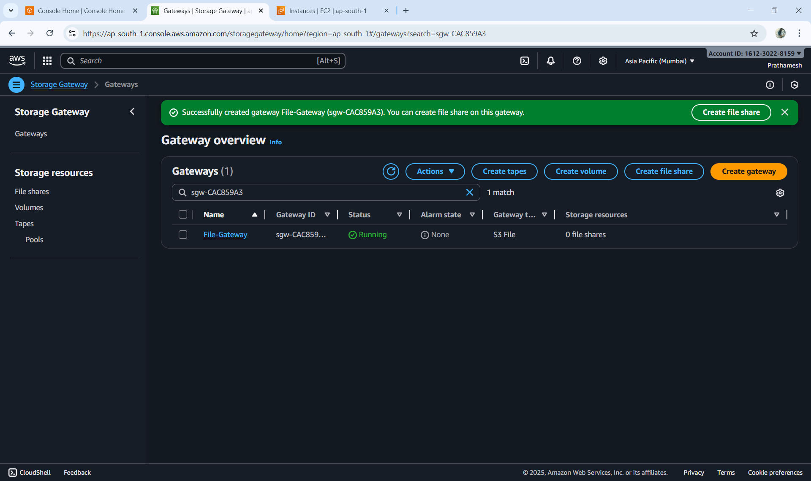
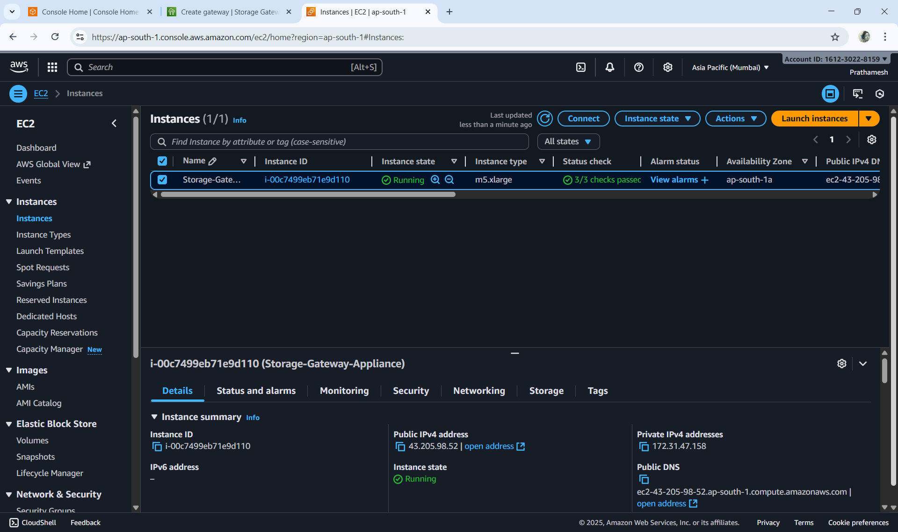
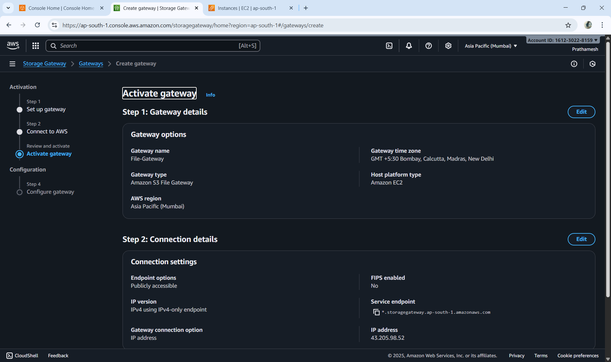
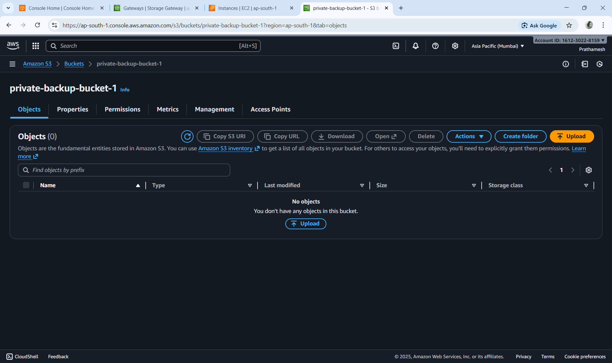
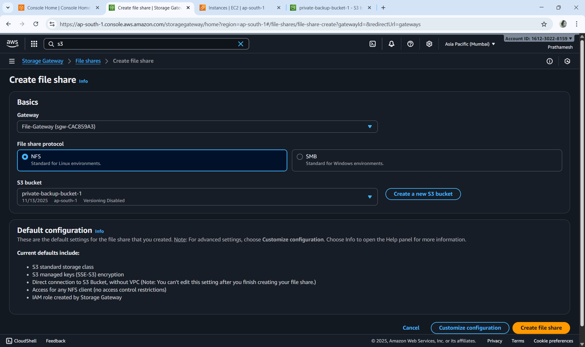
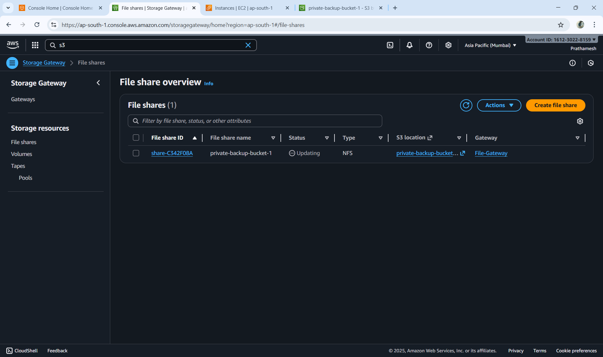
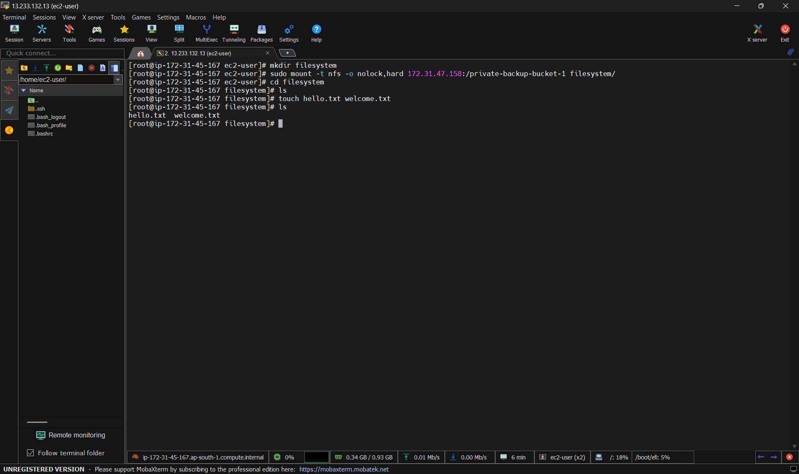
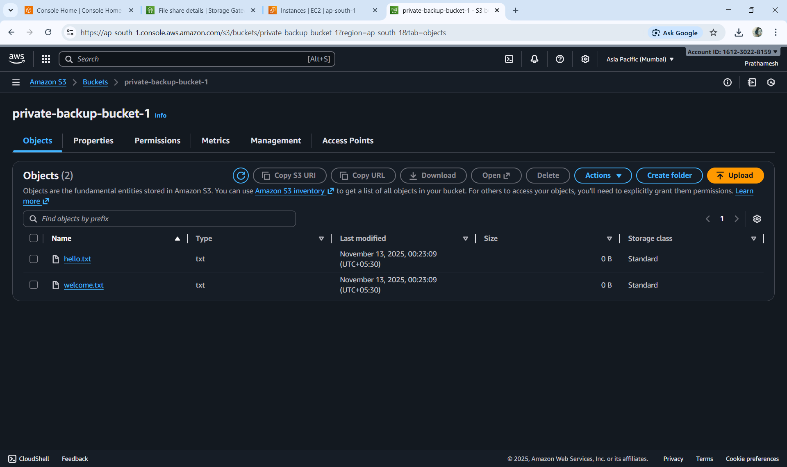

# ☁️ Hybrid Data Replication using AWS Storage Gateway

This project demonstrates how to integrate on-premises storage with AWS S3 using **AWS Storage Gateway (File Gateway)** for seamless **hybrid data replication**.  
It automatically syncs files created in a local NFS mount to an Amazon S3 bucket.

---

## 🚀 Project Overview

AWS **Storage Gateway** enables hybrid cloud storage by connecting on-premises applications to AWS Cloud storage.  
In this project, we configure **File Gateway** to replicate files from a local Linux instance to an S3 bucket.


---

## 🛠️ Step-by-Step Implementation

### **1️⃣ Create Storage Gateway**
- Open the **AWS Storage Gateway Console**
- Choose **File Gateway** as the gateway type
- Deploy gateway on **Amazon EC2**

📸 *Screenshot:*  


---

### **2️⃣ Launch Gateway Appliance**
- Launch an EC2 instance using the **AWS Storage Gateway AMI**
- Recommended instance type: **m5.xlarge** (with 80GB root and 150GB additional volume)
- Ensure **All Traffic** is temporarily allowed in the default Security Group (for setup)
- Note down the **public IP** of the instance — this will be used to activate the gateway

📸 *Screenshot:*  


---

### **3️⃣ Activate the Gateway**
- Go to the **Storage Gateway Console** and click **“Activate Gateway”**
- Enter the public IP of your EC2 appliance
- Complete the activation steps

📸 *Screenshot:*  


---

### **4️⃣ Create an S3 Bucket**
- Go to **Amazon S3** and create a new bucket 
- Keep the bucket **empty** for now

📸 *Screenshot:*  


---

### **5️⃣ Configure File Share**
- In the **Storage Gateway Console**, choose **Create File Share**
- Select **Amazon S3 bucket** as the target
- Choose **NFS** as the access protocol
- Configure other settings and create the file share

📸 *Screenshot:*  


---

### **6️⃣ File Share Created Successfully**
- Once created, note the **Mount Command** displayed for your NFS client
- This command will be used to mount your file share on EC2

📸 *Screenshot:*  


---

### **7️⃣ Mount File Share on EC2**
- Connect to your EC2 instance via SSH and run the following commands:
```bash
sudo -s
yum install -y nfs-utils
mkdir filesystem
sudo mount -t nfs -o nolock,hard 172.31.29.134:/730pm-sgdemo-bkt filesystem/
cd filesystem
ls
touch hello.txt
touch welcome.txt
```


### **8 Successfully replicated backup on S3 bucket**
*Screenshot:*

